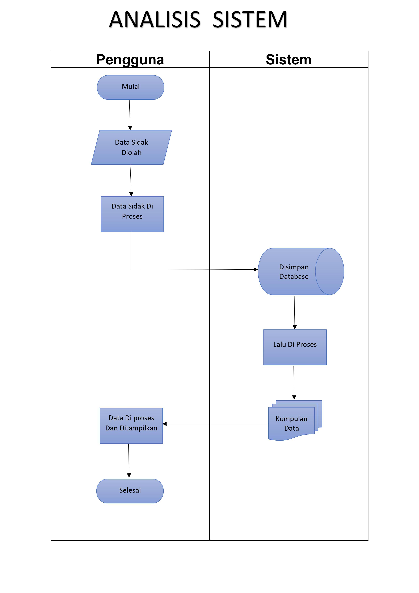

<ul><b>Notes : </b>Tugas tidak diupload ke github hanya inisiatif saya sendiri.</ul>

## Biodata Siswa

<ul><b>Nama : </b>Eko Muchamad Haryono</ul>
<ol><b>Kelas : </b>Rekayasa Perangkat Lunak (RPL)</ol>
<ol><b>Mapel : </b>Basis Data</ol>

<ol><b>Asal Sekolah : </b>SMK 1 Triple "J"</ol>

## Tugas Sekolah

- Membuat Aplikasi db_sidak
- Membuat database db_sidak
- Mengimplementasikan db_sidak menjadi aplikasi Pendataan Menggunakan Bahasa Pemograman PHP.
- Analisis Sistem
- Analisis Kebutuhan

## Analisis Kebutuhan

Kebutuhan aplikasi yaitu dapat yaitu : 

- mengolah dan mengatur informasi data sidak secara tersusun dan terpisah agar data mudah dicari. 
- Agar tersimpan secara aman karena didalam database,di dalam database memiliki keamanan yang cukup terjamin 
- Data akan tersimpan secara sistematis didalam database 
- Memudahkan dalam perkerjaan dalam mendata informasi data sidak 

## Analisis Sistem

